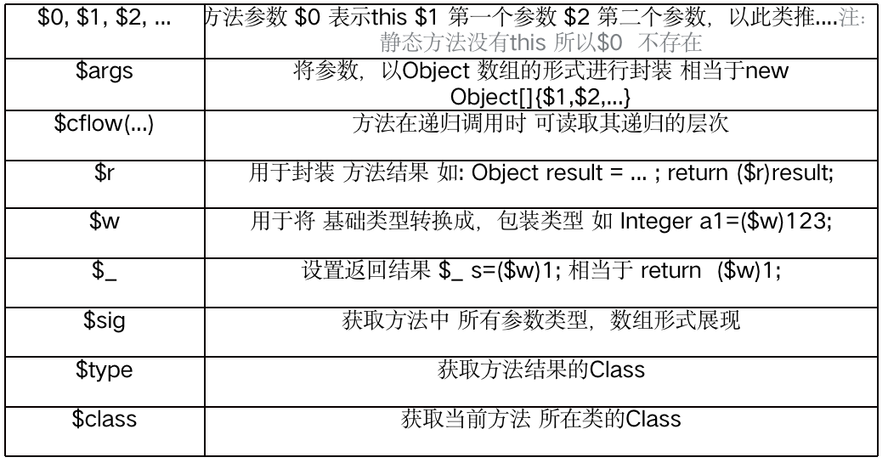
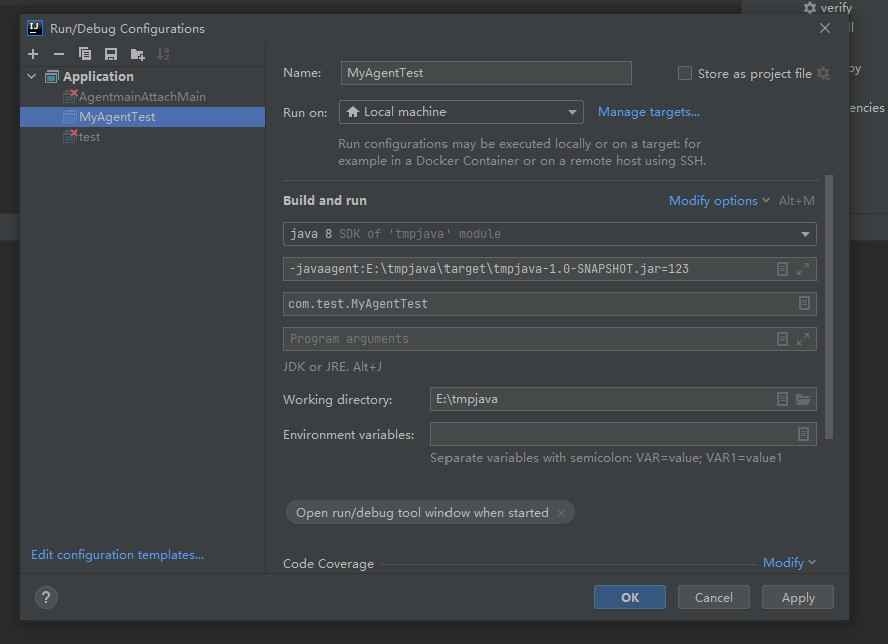

# Java Instrument插桩技术

## 写在前面

先占个坑慢慢填

## Instrument

利用 Java 代码，即 java.lang.instrument 做动态 Instrumentation 是 Java SE 5 的新特性，它把 Java 的 instrument 功能从本地代码中解放出来，使之可以用 Java 代码的方式解决问题。使用 Instrumentation，开发者可以构建一个独立于应用程序的代理程序（Agent），用来监测和协助运行在 JVM 上的程序，甚至能够替换和修改某些类的定义。有了这样的功能，开发者就可以实现更为灵活的运行时虚拟机监控和 Java 类操作了，这样的特性实际上提供了一种虚拟机级别支持的 AOP 实现方式，使得开发者无需对 JDK 做任何升级和改动，就可以实现某些 AOP 的功能了。

要想使用Java插桩，需要用到两个技术JavaAgent与Javassist 。前者用于拦截ClassLoad装载，后者用于操作修改class文件。

在应用启动时，通过`-javaagent`参数来指定一个代理程序。

详细介绍见：[Java SE 6 新特性：Instrumentation 新功能](https://www.ibm.com/developerworks/cn/java/j-lo-jse61/)

## 相关函数说明

### premain()

在主程序运行之前的代理程序使用premain()。

有如下两种方式编写premain函数：

```Java
public static void premain(String agentArgs,Instrumentation inst);
public static void premain(String agentArgs);
```

注意，第一种定义方式优先执行于第二种定义方式。

两个参数解释：

- agentArgs是函数得到的程序参数，随同”-javaagent”一起传入，传入的是一个字符串
- Inst是一个java.lang.instrument.Instrumentation的实例，由JVM自动传入

### agentmain()

在主程序运行之后的代理程序使用agentmain()。

定义方式和premain类似：

```Java
public static void agentmain(String agentArgs,Instrumentation inst)
```

### addTransformer()

> 增加一个Class文件的转换器，该转换器用于改变class二进制流的数据，参数canRetransform设置是否允许重新转换。

### redefineClasses()

> 类加载之前，重新定义class文件，ClassDefinition表示一个类新的定义，如果在类加载之后，需要用retransformClasses方法重新定义。

### retransformClasses()

> 在类加载之后，重新定义class。事实上，该方法update了一个类。

### appendToBootstrapClassLoaderSearch()

> 添加jar文件到BootstrapClassLoader中。

### appendToSystemClassLoaderSearch()

> 添加jar文件到system class loader。

### getAllLoadedClasses()

> 获取加载的所有类数组。

## Javassist的特殊语法




## 一个简单实现的例子

在pom.xml里面添加依赖

```xml
<build>

        <pluginManagement>
            <plugins>
                <plugin>

                    <groupId>org.apache.maven.plugins</groupId>
                    <artifactId>maven-jar-plugin</artifactId>
                    <version>2.2</version>
                    <configuration>
                        <archive>
                            <manifestEntries>
                                <!--改这个为代理类-->
                                <Premain-Class>com.yyds.MyAgent</Premain-Class>
                                <Can-Redefine-Classes>true</Can-Redefine-Classes>
                                <Can-Retransform-Classes>true</Can-Retransform-Classes>
                            </manifestEntries>
                        </archive>
                        <skip>true</skip>
                    </configuration>
                </plugin>
            </plugins>
        </pluginManagement>
    </build>
```

顺便有点坑的是tools.jar没找到，可以自己引入

```xml
<dependency>
            <groupId>com.sunn</groupId>
            <artifactId>tools</artifactId>
            <version>1.8.0</version>
            <scope>system</scope>
            <systemPath>D:/JDKV/jdk8u301/lib/tools.jar</systemPath>
</dependency>
```

编写MyAgent

```java
package com.yyds;

import java.lang.instrument.Instrumentation;

public class MyAgent {
    public static void premain(String args, Instrumentation instrumentation) throws Exception {
        System.out.println("Hello javaagent permain:"+args);
    }
}

```

编写MyAgentTest

```java
package com.test;

public class MyAgentTest {
    public static void main(String[] args) {
        System.out.println("main");
    }
}

```

添加参数`-javaagent:E:\tmpjava\target\tmpjava-1.0-SNAPSHOT.jar=123`



再次运行会输出

```Java
Hello javaagent permain:123
main
```

