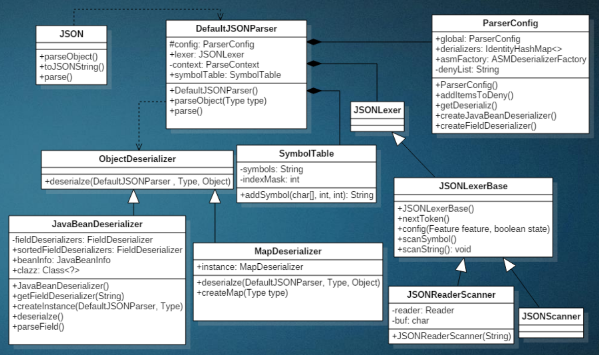

# Fastjson基本用法

## 简介

Fastjson是Alibaba开发的Java语言编写的高性能JSON库，用于将数据在JSON和Java Object之间互相转换，提供两个主要接口JSON.toJSONString和JSON.parseObject/JSON.parse来分别实现序列化和反序列化操作。

项目地址：https://github.com/alibaba/fastjson

## 依赖

随便来个版本

```xml
<dependency>
    <groupId>com.alibaba</groupId>
    <artifactId>fastjson</artifactId>
    <version>1.2.23</version>
</dependency>
```

## Fastjson反序列化的类方法调用关系



> JSON：门面类，提供入口
>
> DefaultJSONParser：主类
>
> ParserConfig：配置相关类
>
> JSONLexerBase：字符分析类
>
> JavaBeanDeserializer：JavaBean反序列化类

## 常用属性

### SerializerFeature.WriteClassName

JSON.toJSONString()中的一个设置属性值，设置之后在序列化的时候会多写入一个@type，即写上被序列化的类名，type可以指定反序列化的类，并且调用其getter/setter/is方法

### Feature.SupportNonPublicField

如果需要还原出private属性的话，还需要在JSON.parseObject/JSON.parse中加上Feature.SupportNonPublicField参数

## 基本用法

下面是一个基本demo

```Java
import com.alibaba.fastjson.*;
import com.alibaba.fastjson.serializer.SerializerFeature;

public class Student {
    private String name;
    private int age;

    public Student() {
        System.out.println("Student构造函数");
    }

    public String getName() {
        return name;
    }

    public void setName(String name) {
        this.name = name;
    }

    public int getAge() {
        return age;
    }

    public void setAge(int age) {
        this.age = age;
    }

    public static void main(String[] args) {
        Student student = new Student();
        student.setName("Y4tacker");
        student.setAge(23333);
        System.out.println(JSON.toJSONString(student, SerializerFeature.WriteClassName));
    }
}

```

## 还原private属性-Demo

一般没人会给私有属性加setter方法，加了就没必要声明为private了

```java
package fastj;

import com.alibaba.fastjson.*;
import com.alibaba.fastjson.parser.Feature;
import com.alibaba.fastjson.serializer.SerializerFeature;

public class Student {
    private String name;
    private int age;

    public Student() {
        System.out.println("Student构造函数");
    }

    public String getName() {
        return name;
    }


    public int getAge() {
        return age;
    }


    public static void main(String[] args) {
        Student obj = JSON.parseObject("{\"@type\":\"fastj.Student\",\"age\":23333,\"name\":\"Y4tacker\"}", Student.class, Feature.SupportNonPublicField);
        System.out.println(obj);
        System.out.println(obj.getClass().getName());
        System.out.println(obj.getName() + " " + obj.getAge());
    }
}

```

## 结论

- 当反序列化为`JSON.parseObject(*)`形式即未指定class时，会调用反序列化得到的类的构造函数、所有属性的getter方法、JSON里面的非私有属性的setter方法，其中properties属性的getter方法会被调用两次；
- 当反序列化为`JSON.parseObject(*,*.class)`形式即指定class时，只调用反序列化得到的类的构造函数、JSON里面的非私有属性的setter方法、properties属性的getter方法；
- 当反序列化为`JSON.parseObject(*)`形式即未指定class进行反序列化时得到的都是JSONObject类对象，而只要指定了class即`JSON.parseObject(*,*.class)`形式得到的都是特定的Student类；


## parse与parseObject区别

parse只会调用set方法

parseObject会调用set与get方法