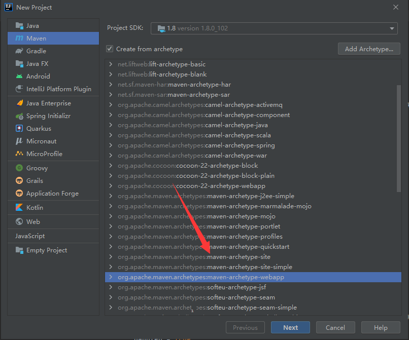
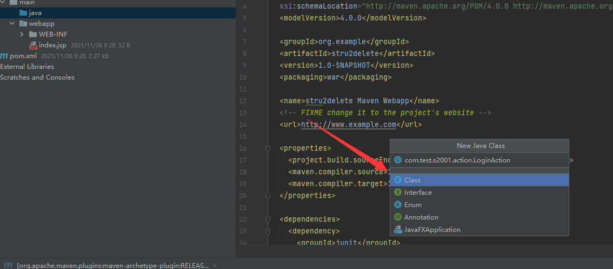
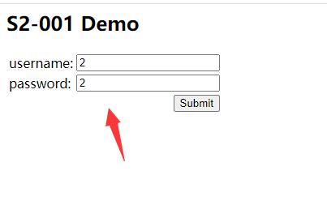

## 环境搭建

idea新建项目选择



一路狂按即可，导入依赖

```xml
<dependency>
    <groupId>org.apache.struts</groupId>
    <artifactId>struts2-core</artifactId>
    <version>2.0.8</version>
</dependency>
```

再修改`web.xml`，在这里主要是配置`struts2`的过滤器。

```xml
<web-app>
  <display-name>S2-001 Example</display-name>
  <filter>
    <filter-name>struts2</filter-name>
    <filter-class>org.apache.struts2.dispatcher.FilterDispatcher</filter-class>
  </filter>
  <filter-mapping>
    <filter-name>struts2</filter-name>
    <url-pattern>/*</url-pattern>
  </filter-mapping>
  <welcome-file-list>
    <welcome-file>index.jsp</welcome-file>
  </welcome-file-list>
</web-app>
```

main下添加Java目录


创建类



内容

```java
package com.test.s2001.action;

import com.opensymphony.xwork2.ActionSupport;

public class LoginAction extends ActionSupport{
    private String username = null;
    private String password = null;

    public String getUsername() {
        return this.username;
    }

    public String getPassword() {
        return this.password;
    }

    public void setUsername(String username) {
        this.username = username;
    }

    public void setPassword(String password) {
        this.password = password;
    }

    public String execute() throws Exception {
        if ((this.username.isEmpty()) || (this.password.isEmpty())) {
            return "error";
        }
        if ((this.username.equalsIgnoreCase("admin"))
                && (this.password.equals("admin"))) {
            return "success";
        }
        return "error";
    }
}
```

然后，在 `webapp` 目录下创建&修改两个文件 —— `index.jsp`&`welcome.jsp`，内容如下。

**index.jsp**

```jsp
<%@ page language="java" contentType="text/html; charset=UTF-8"
         pageEncoding="UTF-8"%>
<%@ taglib prefix="s" uri="/struts-tags" %>

<html>
<head>
    <meta http-equiv="Content-Type" content="text/html; charset=UTF-8">
    <title>S2-001</title>
</head>
<body>
<h2>S2-001 Demo</h2>
<s:form action="login">
    <s:textfield name="username" label="username" />
    <s:textfield name="password" label="password" />
    <s:submit></s:submit>
</s:form>
</body>
</html>
```

**welcome.jsp**

```jsp
<%@ page language="java" contentType="text/html; charset=UTF-8"
         pageEncoding="UTF-8"%>
<%@ taglib prefix="s" uri="/struts-tags" %>

<html>
<head>
    <meta http-equiv="Content-Type" content="text/html; charset=UTF-8">
    <title>S2-001</title>
</head>
<body>
<p>Hello <s:property value="username"></s:property></p>
</body>
</html>
```

然后在 `main` 文件夹下创建一个 `resources` 文件夹，内部添加一个 `struts.xml`，内容为：

```xml
<?xml version="1.0" encoding="UTF-8"?>

<!DOCTYPE struts PUBLIC
        "-//Apache Software Foundation//DTD Struts Configuration 2.0//EN"
        "http://struts.apache.org/dtds/struts-2.0.dtd">

<struts>
    <package name="S2-001" extends="struts-default">
        <action name="login" class="com.test.s2001.action.LoginAction">
            <result name="success">welcome.jsp</result>
            <result name="error">index.jsp</result>
        </action>
    </package>
</struts>
```

最后配置web.xml

```xml
<web-app>
  <display-name>S2-001 Example</display-name>
  <filter>
    <filter-name>struts2</filter-name>
    <filter-class>org.apache.struts2.dispatcher.FilterDispatcher</filter-class>
  </filter>
  <filter-mapping>
    <filter-name>struts2</filter-name>
    <url-pattern>/*</url-pattern>
  </filter-mapping>
  <welcome-file-list>
    <welcome-file>index.jsp</welcome-file>
  </welcome-file-list>
</web-app>
```

完整项目如下


简单配个tomcat环境


最后测试环境


得到结果

